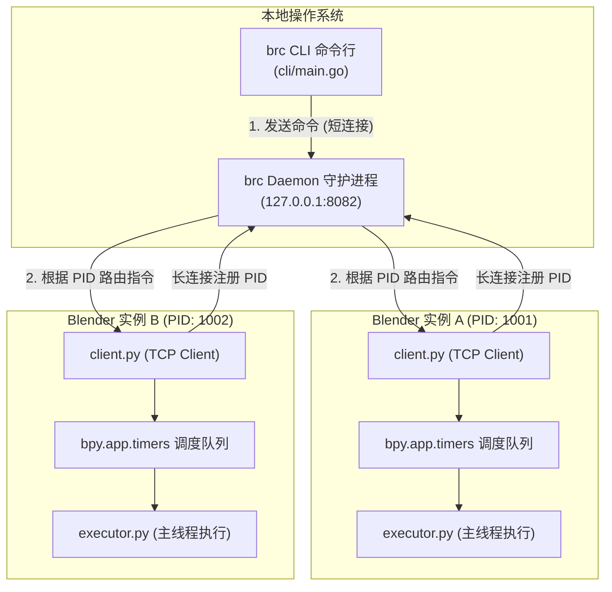

# 开发者指南与架构设计 (Developer & Architecture Guide)

本文档面向希望了解系统底层实现、进行二次开发或参与贡献的开发者。

---

## 🏛️ 整体架构设计

Blender Remote Console 参照 `adb` (Android Debug Bridge) 的经典架构进行设计，由以下三个核心角色组成：



### 1. 各模块职责
* **`cli/` (Go 语言编写)**：
  * 同时承担 **Daemon（守护进程）** 和 **CLI（客户端命令行）** 两个职责。
  * 用户执行 `brc sessions` 或 `brc exec` 时，若 8082 端口未发现守护进程，CLI 会**静默并在后台拉起守护进程**。
  * 守护进程监听 `127.0.0.1:8082`，维护所有连接上来的 Blender 会话 Map（以 PID 为 Key），并负责请求的路由与超时控制。
* **`blender-addon/` (Python 插件)**：
  * 包含 `__init__.py`, `client.py`, `executor.py`, `operators.py`, `ui.py`。
  * 在 Blender 启动时通过 `persistent=True` 的保活定时器持续连接 `127.0.0.1:8082`。
  * 连接建立后主动发送 PID 注册包，随后阻塞读取服务器发来的指令。
  * 收到指令后将代码推入主线程队列（`bpy.app.timers`），由 `executor.py` 评估并返回结果。

---

## 🔌 通信协议设计 (JSON Lines over TCP)

插件与 Daemon 之间采用单行 JSON（`\n` 结尾的 JSON 字符串）通过 TCP Socket 进行双向交互。

### 1. 注册消息 (Plugin -> Daemon)
插件连接到 8082 端口后发送的第一条消息：
```json
{"type": "register", "pid": 12345}
```

### 2. 代码执行请求 (CLI -> Daemon -> Plugin)
Daemon 分配唯一的 `id` 并转发给对应 PID 的 Blender 客户端：
```json
{"type": "exec", "id": "1719200000000", "code": "print(bpy.context.scene.name)"}
```

### 3. 执行结果返回 (Plugin -> Daemon -> CLI)
Blender 主线程执行完成后，将捕获的标准输出、标准错误和表达式返回值回传：
```json
{
  "type": "result",
  "id": "1719200000000",
  "success": true,
  "stdout": "Scene\n",
  "stderr": "",
  "result_repr": null
}
```

---

## 💻 本地开发指南

### 1. 环境要求
* **Go**：>= 1.20
* **Blender**：4.0 及以上版本
* **Python**：Blender 内置 Python 3.10+

### 2. 源码目录结构
```text
blender-remote-console/
├── blender-addon/             # Blender 插件纯 Python 代码
│   ├── __init__.py            # 插件入口、属性注册、保活定时器
│   ├── client.py              # 客户端 Socket 通信与主线程调度
│   ├── executor.py            # AST 代码解析器与执行器
│   ├── operators.py           # Blender 算子（重置命名空间、复制等）
│   └── ui.py                  # 3D Viewport N-Panel 界面
├── cli/                       # Go 语言 CLI & Daemon 源码
│   ├── go.mod                 # Go 模块声明
│   ├── main.go                # CLI 与 Daemon 核心逻辑
│   └── install_addon.go       # 插件安装/卸载/环境检测逻辑
├── scripts/                   # 一键安装脚本 (install.ps1 / install.sh)
├── docs/                      # 开发者文档与设计架构
├── .github/workflows/         # CI/CD 自动构建与发布流水线
├── .gitignore
└── README.md                  # 用户端说明文档
```

### 3. 插件热重载与本地调试

为避免每次修改代码都要手动复制到 Blender 插件目录，建议在开发时使用**目录软链接（Junction）**：

**Windows (PowerShell / CMD 以管理员权限运行)**：
```cmd
mklink /J "%APPDATA%\Blender Foundation\Blender\4.5\scripts\addons\blender-remote-console" "你的项目根目录\blender-addon"
```

**Linux / macOS**：
```bash
ln -s "/你的项目根目录/blender-addon" "$HOME/.config/blender/4.5/scripts/addons/blender-remote-console"
```

### 4. 本地源码一键构建与安装测试 (`~/.brc`)

如果你在本地修改了 CLI 或插件代码，想要模拟完整安装流程直接测试，可以运行：

**Windows (PowerShell)**：
```powershell
.\scripts\build-and-install-from-source.ps1
```

**Linux / macOS**：
```bash
./scripts/build-and-install-from-source.sh
```

该脚本会自动完成：
1. 编译本地 `cli/` 源码至 `~/.brc/bin/brc` 并配置 PATH；
2. 将本地 `blender-addon/` 打包生成 `~/.brc/blender-remote-console.zip`；
3. 调用 `brc install-addon` 弹出交互菜单让你选择安装到哪些 Blender 版本。

---

## 🚀 CI/CD 与发版流程

项目通过 `.github/workflows/release.yml` 实现了全自动跨平台构建。

### 发版触发方式
只需在主分支上打上版本 Tag 并推送至 GitHub：
```bash
git tag v1.0.0
git push origin v1.0.0
```

GitHub Actions 将会自动执行：
1. 交叉编译跨平台二进制产物：
   * `brc-windows-amd64.exe`
   * `brc-linux-amd64`
   * `brc-linux-arm64`
   * `brc-darwin-amd64`
   * `brc-darwin-arm64`
2. 自动打包 `blender-addon/` 目录为 `blender-remote-console.zip`。
3. 发布 GitHub Release 并上传上述全部资产，供用户通过 `install.ps1` / `install.sh` 一键安装。
